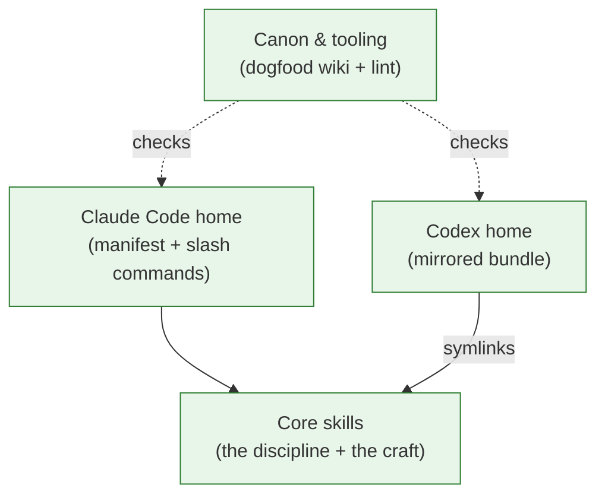

# Block diagram — the `stories` plugin

This repo is a **plugin** that keeps a living, story-shaped wiki of any codebase it's installed into. There is no application code here — the product is a set of markdown rule-files ("skills"), shipped into two AI coding tools (Claude Code and Codex), plus one small health-check script. The map below shows the four parts and how they depend on each other.

| block | in plain words | more |
|---|---|---|
| Core skills | The rule-files that are the actual product — how the wiki is kept and how its pages are written | [core-skills](docs/stories/systems/core-skills.md) |
| Claude Code home | The packaging that installs those rules into Claude Code, plus its four `/stories-*` commands | [claude-code-home](docs/stories/systems/claude-code-home.md) |
| Codex home | A mirror of the same plugin for the Codex tool — same rules via symlinks, own packaging | [codex-home](docs/stories/systems/codex-home.md) |
| Canon & tooling | This repo's own wiki (the plugin used on itself) and the script that checks nothing has drifted | [canon-tooling](docs/stories/systems/canon-tooling.md) |

## New since 2026-07-01

All four blocks — the shape-map itself is new (see `docs/stories/sagas/the-map.md`).

---

Deeper: `docs/stories/index.md` (the Atlas).

<!-- derived by the stories plugin — source of truth: docs/stories/systems/ -->
