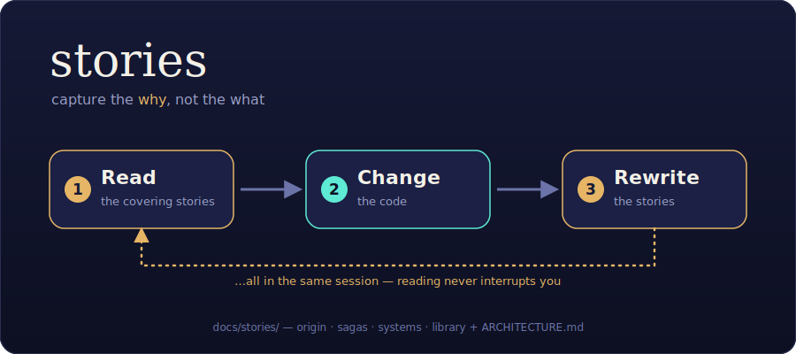

# stories

[](https://github.com/suncloudsmoon/stories/actions/workflows/lint.yml)
[](LICENSE)



A Claude Code plugin that maintains a **soul-bearing wiki** of your codebase under `docs/stories/`.

Most docs describe *what* the code does. Stories capture the *why* — the tension a decision resolved, the road not taken, what the maker cares about. The model reads the relevant stories before any non-trivial change and rewrites them after, so the canon stays true as the code moves. The same wiki doubles as a general knowledge base for deep-research results, syntheses, and sources — one interlinked graph where research links to the code it shaped.

It's a storytelling take on the LLM-wiki pattern: the same LLM-maintained, compounding knowledge base, repointed from "a knowledge base of sources" to "the soul of a codebase."

## Install (Claude Code)

```bash
claude plugin marketplace add suncloudsmoon/plugins   # registers marketplace "suncloudsmoon"
claude plugin install stories@suncloudsmoon

# or from a local clone, before it's published:
#   claude plugin marketplace add /path/to/stories
```

Restart Claude Code to load it. The plugin stays **dormant** until a repo has `docs/stories/` — run `/stories-init` there to create one.

## How it works

- **Skill-only.** No hooks, no runtime scripts — an always-on skill carries the discipline (a dev-only `scripts/lint-canon.py` checks canon health but ships nothing to users). Portable — and ported to Codex (see `codex/`).
- **Read-before-change gate.** Before a change that reshapes the repo's behavior, structure, or soul (feature, refactor, interface change, moving/deleting code) the model reads the stories whose `covers:` matches the files in play. Routine changes are **default-exempt** — bug fixes, typos, formatting, comments, dependency bumps, test-only edits — *unless* they're significant enough to change the repository, in which case they're storied too.
- **Low friction.** Reading never interrupts you. The model proceeds on judgment and stops to ask only on a real conflict — or when something genuinely warrants your attention.
- **Auto-author.** After a gated change, the model rewrites the affected stories in the same session — and closes by running the canon linter when the repo carries one.
- **Deep research auto-files.** A deep-research run lands as a `research` page in the library, cross-linked into the graph.
- **Shape-map.** Alongside the why, the plugin keeps the *shape*: `ARCHITECTURE.md` at the repo root — a plain-language block diagram of how the app is put together, every block linked (legend table) to a `docs/stories/systems/` page (`kind: system`, gated like sagas), recently added blocks highlighted. Derived from the systems pages by the model; updated as part of the same read-then-rewrite discipline.

## Layout

```
docs/stories/
  index.md      # the Atlas — read first
  log.md        # the chronicle
  origin.md     # why this project exists, its soul, your preferences as lore
  sagas/        # code subsystem & flow soul
  vignettes/    # optional file-level shorts
  systems/      # the shape-map — one block-diagram page per segment
  library/      # deep research, syntheses, sources, concepts
```

Plus `ARCHITECTURE.md` at the repo root — the shape-map's plain-language face.

## Commands

- `/stories-init` — bootstrap `docs/stories/`, interview you, write the origin saga.
- `/stories-refresh` — full cleanup: reconcile against the code, rewrite stale, delete dead canon, rebuild the Atlas.
- `/stories-ingest <source|research>` — file knowledge into the library by hand.
- `/stories-lint` — read-only health-check: drift, staleness, dead links/citations, two-homes sync.

## Coexistence

`stories` lives in its own namespace and its own `docs/` subdir. It works **with or without** superpowers and never replaces it.

## Codex

A Codex plugin bundle lives in `codex/` — `.codex-plugin/` plus skills, with the two core skills symlinked to the root `skills/` (single source, no drift). Same behavior, Codex-native packaging; invoke the commands as `$stories-init` etc. See `codex/README.md` for install. Porting notes: `docs/stories/library/codex-conventions.md`.

## Design

See `docs/specs/2026-06-14-stories-plugin-design.md` for the full design and the decisions behind it.

## License

MIT — see [`LICENSE`](LICENSE). Copyright © 2026 suncloudsmoon.
