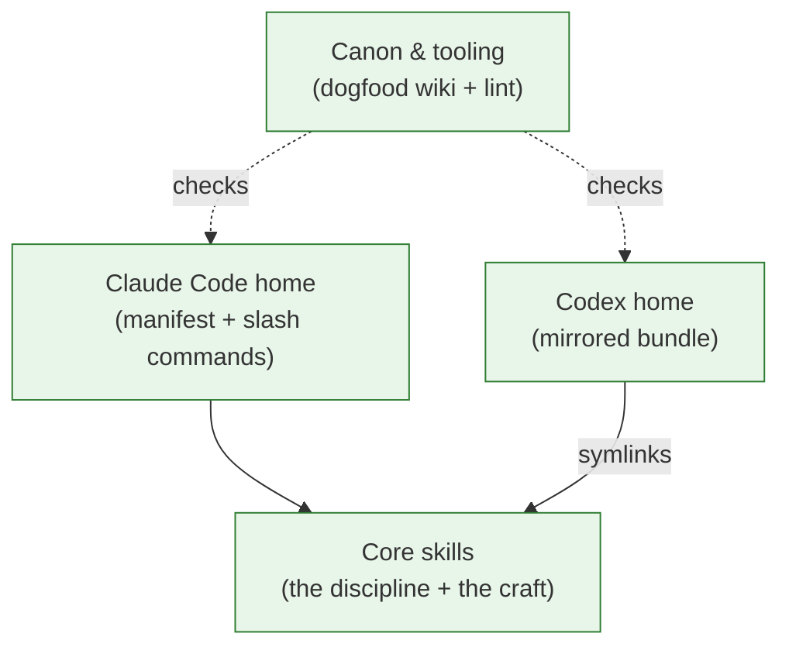

# Systems Layer (BLOCK_DIAGRAM.md + `kind: system`) Implementation Plan

> **For agentic workers:** REQUIRED SUB-SKILL: Use superpowers:subagent-driven-development (recommended) or superpowers:executing-plans to implement this plan task-by-task. Steps use checkbox (`- [ ]`) syntax for tracking.

**Goal:** Add the systems layer to the `stories` plugin — an auto-maintained shape-map (`BLOCK_DIAGRAM.md` at repo root + `docs/stories/systems/` canon pages, new `kind: system`) — per the approved spec `docs/specs/2026-07-01-systems-layer-design.md`.

**Architecture:** Pure-markdown feature carried by the existing two skills and four commands (no new skills, no new commands, no hooks — decision S8). `docs/stories/systems/<segment>.md` pages are the source of truth (gated via `covers:` like sagas); the root `BLOCK_DIAGRAM.md` is a model-derived view. `scripts/lint-canon.py` gains mechanical systems checks. Everything is duplicated into the Codex home per the two-homes rule, then the repo dogfoods the feature on itself.

**Tech Stack:** Markdown + YAML frontmatter, Mermaid diagrams, Python 3 (stdlib only) for the linter.

## Global Constraints

- **Skill-only invariant (base decision #2):** no hooks, no shipped scripts. `scripts/lint-canon.py` is the one sanctioned dev/CI tool.
- **Two homes:** every change to `commands/*.md` must land identically (same normalized step titles) in `codex/skills/stories-*/SKILL.md`; the two `plugin.json` files must agree on `name`, `version`, `description`, `keywords`. `skills/` is symlinked into `codex/` — edits there sync automatically.
- **Three-places rule:** the behavioral contract lives in `skills/stories/SKILL.md`, `README.md`, and the base spec `docs/specs/2026-06-14-stories-plugin-design.md` §4.2/§9 — all three get the `system` kind.
- **Root file name:** `BLOCK_DIAGRAM.md` (user's call; ARCHITECTURE.md rejected for now — spec §3).
- **Derived-by marker (exact string, used by lint and by the never-overwrite rule):** `<!-- derived by the stories plugin — source of truth: docs/stories/systems/ -->`
- **Mermaid node id convention:** node id = page slug with `-` → `_` (e.g. page `core-skills.md` → node `core_skills`).
- **Recency window:** 14 days (spec S6).
- **Block granularity:** system pages/diagrams never inventory per-file/per-function.
- **Before every commit:** run `python3 scripts/lint-canon.py` — must print `RESULT: OK` (exit 0). Warns are acceptable; errors are not.
- **Commit messages** end with: `Co-Authored-By: Claude Fable 5 <noreply@anthropic.com>`
- Today's date for all `refreshed:` fields and log entries: **2026-07-01**.

---

### Task 1: The contract — `skills/stories/SKILL.md`

**Files:**
- Modify: `skills/stories/SKILL.md` (symlinked into `codex/skills/stories/` — no separate Codex edit)

**Interfaces:**
- Consumes: nothing.
- Produces: the `system` kind, the systems-layer conventions (marker string, legend rule, node-id rule, 14-day window), and the extended write-sweep that Tasks 3–6 rely on. Later tasks refer to these as "the systems-layer rules in the `stories` skill".

- [ ] **Step 1: Extend the skill's frontmatter description** so the skill loads when shape-map work is in play. Replace (in `skills/stories/SKILL.md:3`):

```
Also when filing deep-research results, sources, or knowledge. Establishes the read-before-change gate, the conflict-only ask rule, auto-authoring, and the soul-bearing canon conventions.
```

with:

```
Also when filing deep-research results, sources, or knowledge, and when creating or updating the shape-map (BLOCK_DIAGRAM.md / docs/stories/systems/). Establishes the read-before-change gate, the conflict-only ask rule, auto-authoring, the systems layer, and the soul-bearing canon conventions.
```

- [ ] **Step 2: Add `systems/` to the canon tree.** In the `## The canon on disk` code block, insert after the `vignettes/` line:

```
  systems/      # the shape-map — one block-diagram page per segment (kind: system)
```

and immediately after that code block's closing fence, add this paragraph:

```markdown
Plus one artifact **outside** the wiki: `BLOCK_DIAGRAM.md` at the repo root — the shape-map's human face, derived from the `systems/` pages (see *The systems layer* below).
```

- [ ] **Step 3: Add `system` to the frontmatter kind enum.** In the frontmatter schema block, replace:

```
kind:      origin | saga | vignette | research | concept | source | reference
```

with:

```
kind:      origin | saga | vignette | system | research | concept | source | reference
```

- [ ] **Step 4: Add the kinds-table row.** After the `| \`saga\`, \`vignette\` | ...` row in the `### Kinds` table, insert:

```
| `system` | init, refresh, or a structural change (auto) | **YES** (`covers:`) | legible + complete (shape, not soul) |
```

- [ ] **Step 5: Insert the new section** between the `### Kinds` table and `## The gate — read before you change`:

```markdown
## The systems layer — the shape-map

Stories carry the *why*; **system pages** carry the *shape*: block-diagram maps of how the app is put together — exhaustive where stories are curated. Everything in the program is accounted for by some block. Two artifacts:

- **`docs/stories/systems/<segment>.md` — source of truth.** One page per top-level block; you choose the segmentation (frontend/backend, pipeline stages, packages — whatever the repo's true shape is). Body: plain-language lead (one breath) → a segment-level Mermaid diagram if inner structure earns one → the parts and what each does, cited `path:line` → boundaries (what it exposes, what it must not know) → `[[links]]` to the sagas carrying its why. Block granularity always — the moment a page reads like a directory listing it has failed its bar.
- **`BLOCK_DIAGRAM.md` at the repo root — the face,** derived by you from the systems pages (never a script). Contents in order: one plain-language paragraph on what the app is (the top level stays jargon-free; technicals live one link down); the top-level Mermaid `flowchart` (node id = page slug with `-`→`_`); a **legend table** — block → one-line plain description → link to its systems page (the legend is the guaranteed "click"; also emit Mermaid `click <id> "<path>"` directives — a bonus some renderers strip); a `## New since <YYYY-MM-DD>` section naming recently added/reshaped blocks, styled `classDef new` in the diagram and aged out at refresh once older than ~14 days (dates from `log.md`); and the footer marker `<!-- derived by the stories plugin — source of truth: docs/stories/systems/ -->`.

Rules: **never overwrite** a hand-written `BLOCK_DIAGRAM.md`/`ARCHITECTURE.md` that lacks the marker — that is a conflict, surface it. A tiny repo may carry the whole map in the root file and grow `systems/` pages only when a segment earns one. Structural change ⇒ update the affected system pages in the same session, and re-derive the root file when the top-level picture moves.
```

- [ ] **Step 6: Extend the write-sweep.** In `## After the change — author the canon (auto)`, replace the bullet:

```
- update every story whose soul shifted,
```

with:

```
- update every story whose soul shifted, and every system page whose shape shifted (re-derive `BLOCK_DIAGRAM.md` when the top-level picture moved),
```

- [ ] **Step 7: Verify + lint.**

Run: `grep -c "systems layer" skills/stories/SKILL.md` → expected: `3` or more.
Run: `grep -n "system |" skills/stories/SKILL.md` → the enum line and the table row both appear.
Run: `python3 scripts/lint-canon.py` → expected: `RESULT: OK` (warns about STALE sagas are fine — the dogfood task refreshes them).

- [ ] **Step 8: Commit**

```bash
git add skills/stories/SKILL.md
git commit -m "feat: systems layer — kind: system + shape-map conventions in the discipline skill

Co-Authored-By: Claude Fable 5 <noreply@anthropic.com>"
```

---

### Task 2: The craft — `skills/writing-a-story/SKILL.md`

**Files:**
- Modify: `skills/writing-a-story/SKILL.md` (symlinked into Codex home — no separate edit)

**Interfaces:**
- Consumes: the `system` kind from Task 1.
- Produces: the `system` craft bar that Tasks 4 and 6 cite.

- [ ] **Step 1: Add the spine variant.** After the line `A short vignette may collapse steps 1–2 and 4 into a few sentences. An origin saga may dwell. Bend the spine; don't pad it.` append:

```markdown

A `system` page swaps the spine for the **shape**: plain-language lead → diagram (if inner structure earns one) → the parts, cited → boundaries → links onward. Its art is legibility, not narrative — but the last line of its lead should still say *why this segment exists at all*, in one sentence, linking the saga that carries the full why.
```

- [ ] **Step 2: Add the kind-bar row.** In the `## Kind-aware bar` table, insert after the `origin, saga, vignette` row:

```
| `system` | legible + complete — plain lead, exhaustive within its block, block granularity (never per-file); shape, not soul |
```

- [ ] **Step 3: Verify + lint.**

Run: `grep -n "system" skills/writing-a-story/SKILL.md` → spine variant + table row present.
Run: `python3 scripts/lint-canon.py` → `RESULT: OK`.

- [ ] **Step 4: Commit**

```bash
git add skills/writing-a-story/SKILL.md
git commit -m "feat: craft bar for kind: system (legible + complete, shape not soul)

Co-Authored-By: Claude Fable 5 <noreply@anthropic.com>"
```

---

### Task 3: The lint engine — systems checks (test-first)

**Files:**
- Modify: `scripts/lint-canon.py`
- Modify: `commands/stories-lint.md` (step-1 text)
- Modify: `codex/skills/stories-lint/SKILL.md` (step-1 text, kept in sync)
- Fixture (temporary, in scratchpad — never committed): `<scratchpad>/lintfix/`

**Interfaces:**
- Consumes: marker string + node-id convention from Global Constraints.
- Produces: lint rules that Task 6's dogfood artifacts must satisfy: (a) `systems/*.md` present ⇒ `BLOCK_DIAGRAM.md` exists at root; (b) every `systems/*.md` linked from `BLOCK_DIAGRAM.md` as `(docs/stories/systems/<slug>.md)`; (c) every such link resolves; (d) marker present (warn); (e) diagram node ids ↔ legend slugs (warn); (f) top-level code dirs covered by some system page's `covers:` (warn). Also `system` joins `CODE_KINDS` (a `system` page without `covers:` is an error).

- [ ] **Step 1: Build the failing fixture** (baseline: current lint must NOT flag it).

```bash
S="/private/tmp/claude-501/-Volumes-dev-ai-work-suncloudsmoon-stories/b69dee18-384f-41d4-85c3-5b45ceac5a4e/scratchpad"
mkdir -p "$S/lintfix/docs/stories/systems" "$S/lintfix/src"
printf 'x = 1\n' > "$S/lintfix/src/a.py"
cat > "$S/lintfix/docs/stories/systems/core.md" <<'EOF'
---
title: Core
kind: system
covers: ["src/**"]
links: []
refreshed: 2026-07-01
---

Core segment.
EOF
```

- [ ] **Step 2: Run lint on the fixture — verify the gap (test "fails")**

Run: `python3 scripts/lint-canon.py "$S/lintfix"; echo "exit=$?"`
Expected: `RESULT: OK`, `exit=0` — i.e. today's lint is blind to a systems page with **no root `BLOCK_DIAGRAM.md`**. That blindness is the bug this task fixes.

- [ ] **Step 3: Implement the checks.** In `scripts/lint-canon.py`:

3a. Replace `CODE_KINDS = {"saga", "vignette"}` with:

```python
CODE_KINDS = {"saga", "vignette", "system"}
```

3b. Insert this block between the `# ---- manifest + command drift ... ----` section and the `# ---- coverage gap (INFO) ----` section:

```python
# ---- systems layer: BLOCK_DIAGRAM.md <-> docs/stories/systems/ ----
BLOCK_FILE = ROOT / "BLOCK_DIAGRAM.md"
MARKER = "derived by the stories plugin"
SKIP_DIRS = {"docs", "node_modules", "vendor", "dist", "build", "target"}
MERMAID_KEYWORDS = {"flowchart", "graph", "subgraph", "end", "classDef", "class", "click", "style", "direction"}
sys_dir = STORIES / "systems"
system_pages = sorted(sys_dir.glob("*.md")) if sys_dir.is_dir() else []

if system_pages and not BLOCK_FILE.exists():
    errors.append("systems: pages exist under docs/stories/systems/ but BLOCK_DIAGRAM.md missing at repo root")

if BLOCK_FILE.exists():
    body = BLOCK_FILE.read_text(encoding="utf-8")
    if MARKER not in body:
        warns.append("BLOCK_DIAGRAM.md: no derived-by marker — hand-written? never overwrite it")
    linked = set(re.findall(r"\(docs/stories/systems/([\w-]+)\.md\)", body))
    for p in system_pages:
        if p.stem not in linked:
            errors.append(f"BLOCK_DIAGRAM.md: system page '{p.stem}' not linked from the legend")
    for slug in sorted(linked):
        if not (sys_dir / f"{slug}.md").exists():
            errors.append(f"BLOCK_DIAGRAM.md: legend links missing page docs/stories/systems/{slug}.md")
    blocks = re.findall(r"```mermaid\n(.*?)```", body, re.S)
    if blocks:
        ids = {i for i in re.findall(r"^\s*([A-Za-z]\w*)\s*[\[(]", blocks[0], re.M)
               if i not in MERMAID_KEYWORDS}
        legend_ids = {s.replace("-", "_") for s in linked}
        for i in sorted(ids - legend_ids):
            warns.append(f"BLOCK_DIAGRAM.md: diagram node '{i}' has no legend link")

if system_pages:
    sys_cover_roots = set()
    for p in system_pages:
        fmp = frontmatter(p.read_text(encoding="utf-8")) or ""
        for g in fm_list(fmp, "covers"):
            root_seg = g.split("/")[0]
            if root_seg and "*" not in root_seg:
                sys_cover_roots.add(root_seg)
    for d in sorted(ROOT.iterdir()):
        if (d.is_dir() and not d.name.startswith(".")
                and d.name not in SKIP_DIRS and d.name not in sys_cover_roots):
            warns.append(f"systems: top-level dir '{d.name}/' not covered by any system page")
```

3c. Update the module docstring's check list (line 2-ish): after `Read-only. Exit 1 on errors.` no change needed — but extend the comment above `SOURCE_GLOBS` only if inaccurate (it isn't). No other changes.

- [ ] **Step 4: Run lint on the fixture — verify the new checks fire**

Run: `python3 scripts/lint-canon.py "$S/lintfix"; echo "exit=$?"`
Expected: `ERRORS (1)` containing `systems: pages exist under docs/stories/systems/ but BLOCK_DIAGRAM.md missing at repo root`, `RESULT: FAILED`, `exit=1`.

Then exercise the remaining rules:

```bash
cat > "$S/lintfix/BLOCK_DIAGRAM.md" <<'EOF'
An app.


| block | what | page |
|---|---|---|
| Core | the core | [core](docs/stories/systems/core.md) |
| Gone | missing | [gone](docs/stories/systems/gone.md) |
EOF
python3 scripts/lint-canon.py "$S/lintfix"; echo "exit=$?"
```

Expected: `exit=1` with — error `legend links missing page docs/stories/systems/gone.md`; warn `no derived-by marker`; warn `diagram node 'ghost' has no legend link`; warn `top-level dir 'src/' not covered` **absent** (covers `src/**` → root seg `src` counted). Fix the fixture (remove the `gone` row, add the marker line) and re-run → `RESULT: OK`, `exit=0`.

- [ ] **Step 5: Run lint on this repo (no systems layer yet — dormancy holds)**

Run: `python3 scripts/lint-canon.py; echo "exit=$?"`
Expected: `RESULT: OK`, `exit=0`, and **no** `systems:` findings (no `docs/stories/systems/` dir yet, no `BLOCK_DIAGRAM.md` yet).

- [ ] **Step 6: Sync the lint command text (both homes).** In `commands/stories-lint.md` step 1, replace:

```
Run `python3 scripts/lint-canon.py`. It checks broken `[[links]]`, dead `covers:` and `path:line` citations, manifest drift, command drift (Claude Code ↔ Codex), staleness (git), and coverage gaps. It exits non-zero on errors.
```

with:

```
Run `python3 scripts/lint-canon.py`. It checks broken `[[links]]`, dead `covers:` and `path:line` citations, manifest drift, command drift (Claude Code ↔ Codex), staleness (git), coverage gaps, and the systems layer (BLOCK_DIAGRAM.md ↔ systems pages ↔ legend, top-level coverage). It exits non-zero on errors.
```

In `codex/skills/stories-lint/SKILL.md` step 1, replace:

```
1. **Run the engine.** Run `python3 scripts/lint-canon.py` — it checks broken `[[links]]`, dead `covers:` and `path:line` citations, manifest drift, command drift (Claude Code ↔ Codex), staleness (git), and coverage gaps. It exits non-zero on errors.
```

with:

```
1. **Run the engine.** Run `python3 scripts/lint-canon.py` — it checks broken `[[links]]`, dead `covers:` and `path:line` citations, manifest drift, command drift (Claude Code ↔ Codex), staleness (git), coverage gaps, and the systems layer (BLOCK_DIAGRAM.md ↔ systems pages ↔ legend, top-level coverage). It exits non-zero on errors.
```

- [ ] **Step 7: Final verify + commit**

Run: `python3 scripts/lint-canon.py; echo "exit=$?"` → `RESULT: OK`, `exit=0` (command-drift check confirms the two lint texts still share step structure).
Run: `rm -rf "$S/lintfix"` (fixture is disposable).

```bash
git add scripts/lint-canon.py commands/stories-lint.md codex/skills/stories-lint/SKILL.md
git commit -m "feat: lint learns the systems layer (BLOCK_DIAGRAM <-> systems pages <-> legend, coverage)

Co-Authored-By: Claude Fable 5 <noreply@anthropic.com>"
```

---

### Task 4: Lifecycle — `stories-init` + `stories-refresh` (both homes)

**Files:**
- Modify: `commands/stories-init.md`
- Modify: `codex/skills/stories-init/SKILL.md`
- Modify: `commands/stories-refresh.md`
- Modify: `codex/skills/stories-refresh/SKILL.md`

**Interfaces:**
- Consumes: systems-layer rules (Task 1), craft bar (Task 2), lint rules (Task 3).
- Produces: the init/refresh procedures Task 6 executes on this repo. **Step titles must normalize identically across homes** (`lint-canon.py step_titles()` compares them): CC `## 5. Map the systems` ↔ Codex `5. **Map the systems.**`, CC `## 6. Wire it up` ↔ Codex `6. **Wire it up.**`.

- [ ] **Step 1: `commands/stories-init.md`** — three edits:

1a. In `## 2. Create the skeleton`, replace:

```
- empty dirs `docs/stories/sagas/`, `docs/stories/vignettes/`, `docs/stories/library/`, each with a `.gitkeep`.
```

with:

```
- empty dirs `docs/stories/sagas/`, `docs/stories/vignettes/`, `docs/stories/systems/`, `docs/stories/library/`, each with a `.gitkeep`.
```

1b. Replace the heading `## 5. Wire it up` with `## 6. Wire it up`, and insert this new section before it:

```markdown
## 5. Map the systems
Scan the repo and choose its real segments — frontend/backend, pipeline stages, packages; your call, at block granularity. For each, author `docs/stories/systems/<segment>.md` (kind `system`, `covers:` globs, plain-language lead — per the systems-layer rules in the `stories` skill and the craft bar in `writing-a-story`). Then derive the root `BLOCK_DIAGRAM.md`: plain summary, top-level Mermaid flowchart, legend table linking every block to its page, `## New since <today>` section, derived-by marker. Everything in the program accounted for. A tiny repo may take the root file alone (grow pages later). If a hand-written `BLOCK_DIAGRAM.md`/`ARCHITECTURE.md` already exists (no marker), do not touch it — surface it instead.
```

1c. In the (now) `## 6. Wire it up` body, replace:

```
Add `origin.md` to the Atlas under `## Origin` with a one-line hook. Append a log entry. Report the tree you created.
```

with:

```
Add `origin.md` to the Atlas under `## Origin`, and each systems page under `## Systems`, with one-line hooks. Append a log entry. Report the tree you created.
```

- [ ] **Step 2: `codex/skills/stories-init/SKILL.md`** — mirror edits:

2a. In step 2, replace `and dirs `sagas/`, `vignettes/`, `library/`, each with a `.gitkeep`.` with `and dirs `sagas/`, `vignettes/`, `systems/`, `library/`, each with a `.gitkeep`.`

2b. Replace the line beginning `5. **Wire it up.**` with these two lines:

```
5. **Map the systems.** Choose the repo's real segments (block granularity). Author `docs/stories/systems/<segment>.md` for each (kind `system`, `covers:`, plain lead — per the systems-layer rules in the `stories` skill) and derive the root `BLOCK_DIAGRAM.md`: plain summary, top-level Mermaid flowchart, legend table linking every block to its page, `## New since <today>`, derived-by marker. Everything accounted for; a tiny repo may take the root file alone. Never touch a hand-written BLOCK_DIAGRAM.md/ARCHITECTURE.md (no marker) — surface it.
6. **Wire it up.** Add `origin.md` to the Atlas under `## Origin`, and each systems page under `## Systems`, with one-line hooks; append a log entry; report the tree.
```

- [ ] **Step 3: `commands/stories-refresh.md`** — two edits (titles unchanged; text only):

3a. In `## 2. Reconcile against the code`, after the `For each \`library\` page...` line, append:

```markdown

For each `system` page, walk the code it covers: blocks appeared, vanished, or reshaped → update the page, then re-derive `BLOCK_DIAGRAM.md` (diagram, legend, `New since` section — age out entries older than ~14 days). Verify everything in the program is still accounted for — a segment with no block is a gap to fill; if the repo has no systems layer yet, offer to build one, once.
```

3b. In `## 5. Rebuild & log`, replace:

```
Regenerate `index.md` from what now exists.
```

with:

```
Regenerate `index.md` from what now exists (systems pages under `## Systems`).
```

- [ ] **Step 4: `codex/skills/stories-refresh/SKILL.md`** — mirror edits:

4a. In step 2, replace `For `library` pages: check `sources:` and links still hold.` with:

```
For `library` pages: check `sources:` and links still hold. For `system` pages: blocks appeared/vanished/reshaped → update the page and re-derive `BLOCK_DIAGRAM.md` (age out `New since` entries older than ~14 days); everything accounted for — no systems layer yet → offer to build one, once.
```

4b. In step 5, replace `Regenerate `index.md`;` with `Regenerate `index.md` (systems pages under `## Systems`);`

- [ ] **Step 5: Verify + lint + commit**

Run: `python3 scripts/lint-canon.py; echo "exit=$?"` → `RESULT: OK`, `exit=0`, and **no** `command drift:` warnings for `stories-init` or `stories-refresh` (proves step titles still match across homes).

```bash
git add commands/stories-init.md commands/stories-refresh.md codex/skills/stories-init/SKILL.md codex/skills/stories-refresh/SKILL.md
git commit -m "feat: init maps the systems; refresh reconciles + ages the shape-map (both homes)

Co-Authored-By: Claude Fable 5 <noreply@anthropic.com>"
```

---

### Task 5: Contract restatement — README, base spec, CLAUDE.md, manifests

**Files:**
- Modify: `README.md`
- Modify: `docs/specs/2026-06-14-stories-plugin-design.md`
- Modify: `CLAUDE.md`
- Modify: `.claude-plugin/plugin.json`
- Modify: `codex/.codex-plugin/plugin.json`

**Interfaces:**
- Consumes: contract wording from Task 1.
- Produces: the three-places contract restated; manifests at `0.3.0` with identical descriptions (lint's manifest-drift check enforces).

- [ ] **Step 1: README.** In `## How it works`, insert after the `- **Deep research auto-files.**` bullet:

```markdown
- **Shape-map.** Alongside the why, the plugin keeps the *shape*: `BLOCK_DIAGRAM.md` at the repo root — a plain-language block diagram of how the app is put together, every block linked (legend table) to a `docs/stories/systems/` page (`kind: system`, gated like sagas), recently added blocks highlighted. Derived from the systems pages by the model; updated as part of the same read-then-rewrite discipline.
```

In `## Layout`, add to the tree after the `vignettes/` line:

```
  systems/      # the shape-map — one block-diagram page per segment
```

and after the tree's closing fence add:

```markdown
Plus `BLOCK_DIAGRAM.md` at the repo root — the shape-map's plain-language face.
```

- [ ] **Step 2: Base spec.** In `docs/specs/2026-06-14-stories-plugin-design.md`:

2a. §4.2 table — insert after the `vignette` row:

```
| `system` | init / refresh / structural change → auto | **yes** (`covers:`) | legible + complete (shape, not soul) |
```

2b. §8 — append after the existing update line:

```markdown
*Update (2026-07-01): the systems layer (shape-map) shipped — `kind: system` + root `BLOCK_DIAGRAM.md`. See `2026-07-01-systems-layer-design.md`.*
```

2c. §9 table — append row:

```
| 15 | Systems layer | Canon kind `system` under `docs/stories/systems/` + model-derived root `BLOCK_DIAGRAM.md`; legend = guaranteed click; lint enforces coverage. Full decisions: `2026-07-01-systems-layer-design.md` §9 |
```

- [ ] **Step 3: CLAUDE.md.** In `## Architecture`, insert after the `commands/stories-{init,refresh,ingest}.md` bullet:

```markdown
- `docs/stories/systems/` + root `BLOCK_DIAGRAM.md` — the **shape-map** (systems layer): block-diagram pages (`kind: system`, gated via `covers:`) with a model-derived plain-language face at the repo root. Spec: `docs/specs/2026-07-01-systems-layer-design.md`.
```

- [ ] **Step 4: Manifests — bump both to 0.3.0 with identical descriptions.** In **both** `.claude-plugin/plugin.json` and `codex/.codex-plugin/plugin.json`:

- `"version": "0.2.0"` → `"version": "0.3.0"`
- Replace the `"description"` value in both with exactly:

```
A soul-bearing wiki for your codebase. The model reads the relevant stories before any non-trivial change and rewrites them after — capturing the why, not the what. Doubles as a general knowledge wiki, and keeps a block-diagram shape-map (BLOCK_DIAGRAM.md) of how the app is put together.
```

(All other fields — `author`, `keywords`, and Codex's `skills`/`interface` — unchanged.)

- [ ] **Step 5: Verify + commit**

Run: `python3 -c "import json; json.load(open('.claude-plugin/plugin.json')); json.load(open('codex/.codex-plugin/plugin.json')); print('json ok')"` → `json ok`.
Run: `python3 scripts/lint-canon.py; echo "exit=$?"` → `RESULT: OK`, `exit=0`, no `manifest drift` errors.

```bash
git add README.md docs/specs/2026-06-14-stories-plugin-design.md CLAUDE.md .claude-plugin/plugin.json codex/.codex-plugin/plugin.json
git commit -m "docs: restate systems-layer contract (README/spec/CLAUDE.md); bump manifests to 0.3.0

Co-Authored-By: Claude Fable 5 <noreply@anthropic.com>"
```

---

### Task 6: Dogfood — this repo's own shape-map + canon updates

**Files:**
- Create: `BLOCK_DIAGRAM.md`
- Create: `docs/stories/systems/core-skills.md`
- Create: `docs/stories/systems/claude-code-home.md`
- Create: `docs/stories/systems/codex-home.md`
- Create: `docs/stories/systems/canon-tooling.md`
- Create: `docs/stories/sagas/the-map.md`
- Modify: `docs/stories/origin.md` (carve-out + link + refreshed)
- Modify: `docs/stories/sagas/one-graph.md` (kinds line + refreshed)
- Modify: `docs/stories/sagas/the-gate.md`, `docs/stories/sagas/the-craft.md`, `docs/stories/sagas/the-lint.md`, `docs/stories/sagas/codex-port.md` (refreshed dates; the-lint also names the new checks)
- Modify: `docs/stories/index.md` (Systems section + the-map)
- Modify: `docs/stories/log.md` (append)

**Interfaces:**
- Consumes: everything above. This task is the plugin's own write-sweep applied to the feature — it must leave `python3 scripts/lint-canon.py` at `RESULT: OK` with **zero STALE warnings** on the touched sagas and **zero systems warnings**.
- Produces: the shipped example of the feature.

- [ ] **Step 1: Write the four system pages.** Exact contents:

`docs/stories/systems/core-skills.md`:

```markdown
---
title: Core skills — the discipline and the craft
kind: system
covers: ["skills/**"]
links: ["[[the-gate]]", "[[the-craft]]", "[[the-map]]"]
refreshed: 2026-07-01
---

# Core skills

The two markdown skills that **are** the product — everything else is packaging. This segment exists so one copy of the rules can serve two hosts ([[the-gate]]).

- `skills/stories/SKILL.md` — the **discipline**: the read-before-change gate, the ask rules, auto-authoring, the systems layer, and the canon conventions (`kind:` table, frontmatter).
- `skills/writing-a-story/SKILL.md` — the **craft**: the light spine, the kind-scaled quality bar, the exemplar.

**Boundaries.** Pure prose — no hooks, no scripts may creep in here (that would break the Codex port). Consumed verbatim by both homes: Claude Code loads it from the repo root, Codex through symlinks (`codex/skills/stories` → `../../skills/stories`). Change these files and both homes change — that is the point.

Why it's shaped this way: [[the-gate]]. How the writing is judged: [[the-craft]].
```

`docs/stories/systems/claude-code-home.md`:

```markdown
---
title: Claude Code home — manifest and slash commands
kind: system
covers: [".claude-plugin/**", "commands/*.md"]
links: ["[[the-gate]]", "[[codex-port]]", "[[the-map]]"]
refreshed: 2026-07-01
---

# Claude Code home

The packaging that makes this repo installable in Claude Code. This segment exists so the core skills stay host-agnostic while the host-specific surface lives in one place.

- `.claude-plugin/plugin.json` — the manifest (name, version, description; hand-synced with the Codex manifest).
- `commands/stories-{init,refresh,ingest,lint}.md` — the four slash commands: bootstrap, deep-clean, manual ingest, health-check.

**Boundaries.** Commands orchestrate; the rules live in the core skills. Every command edit must land identically in `codex/skills/stories-*/SKILL.md` — the sync obligation of [[codex-port]], enforced by lint's command-drift check.

Why two homes: [[codex-port]].
```

`docs/stories/systems/codex-home.md`:

```markdown
---
title: Codex home — the mirrored bundle
kind: system
covers: ["codex/**", "AGENTS.md"]
links: ["[[codex-port]]", "[[the-map]]"]
refreshed: 2026-07-01
---

# Codex home

The second home: a Codex plugin bundle mirroring the Claude Code plugin. This segment exists because the maker chose a separate bundle over a merged dual-manifest repo ([[codex-port]]).

- `codex/.codex-plugin/plugin.json` — the Codex manifest (hand-synced twin).
- `codex/skills/stories`, `codex/skills/writing-a-story` — **symlinks** to the root `skills/` (cannot drift).
- `codex/skills/stories-*/SKILL.md` — the four commands re-expressed as Codex skills (`$stories-init` …), hand-synced.
- `AGENTS.md` — the dogfood discipline for Codex, sibling of `CLAUDE.md`.

**Boundaries.** Nothing original lives here except packaging: rules come from the symlinked core; procedures mirror `commands/`. If this home tells a different story than the root, that is drift — lint flags it, refresh heals it.

The full why: [[codex-port]].
```

`docs/stories/systems/canon-tooling.md`:

```markdown
---
title: Canon & tooling — the wiki and its canary
kind: system
covers: ["scripts/*.py"]
links: ["[[the-lint]]", "[[origin]]", "[[the-map]]"]
refreshed: 2026-07-01
---

# Canon & tooling

The repo's own wiki (`docs/stories/` — this very canon) and the one script allowed to exist. This segment exists because a best-effort discipline needs a canary ([[the-lint]]).

- `docs/stories/` — the dogfood canon: Atlas, log, origin, sagas, this systems layer, library.
- `scripts/lint-canon.py` — read-only health-check: links, covers, citations, staleness, manifest + command drift, coverage, and the systems layer itself. Dev/CI tool only — it ships to no one.

**Boundaries.** The script may diagnose, never treat, and never becomes plugin runtime — the skill-only invariant ([[the-gate]]) holds. If lint passes while the canon is plainly wrong, a check is missing: add one.

Why the exception is allowed: [[the-lint]].
```

- [ ] **Step 2: Write the root `BLOCK_DIAGRAM.md`.** Exact content:

````markdown
# Block diagram — the `stories` plugin

This repo is a **plugin** that keeps a living, story-shaped wiki of any codebase it's installed into. There is no application code here — the product is a set of markdown rule-files ("skills"), shipped into two AI coding tools (Claude Code and Codex), plus one small health-check script. The map below shows the four parts and how they depend on each other.



| block | in plain words | more |
|---|---|---|
| Core skills | The rule-files that are the actual product — how the wiki is kept and how its pages are written | [core-skills](docs/stories/systems/core-skills.md) |
| Claude Code home | The packaging that installs those rules into Claude Code, plus its four `/stories-*` commands | [claude-code-home](docs/stories/systems/claude-code-home.md) |
| Codex home | A mirror of the same plugin for the Codex tool — same rules via symlinks, own packaging | [codex-home](docs/stories/systems/codex-home.md) |
| Canon & tooling | This repo's own wiki (the plugin used on itself) and the script that checks nothing has drifted | [canon-tooling](docs/stories/systems/canon-tooling.md) |

## New since 2026-07-01

All four blocks — the shape-map itself is new (see `docs/stories/sagas/the-map.md`).

---

Deeper: `docs/stories/index.md` (the Atlas).

<!-- derived by the stories plugin — source of truth: docs/stories/systems/ -->
````

- [ ] **Step 3: Write the saga `docs/stories/sagas/the-map.md`.** Exact content:

```markdown
---
title: The Map — Shape Joins the Canon
kind: saga
covers: ["BLOCK_DIAGRAM.md", "docs/stories/systems/*.md"]
links: ["[[origin]]", "[[one-graph]]", "[[the-gate]]", "[[the-lint]]", "[[the-craft]]", "[[core-skills]]", "[[claude-code-home]]", "[[codex-home]]", "[[canon-tooling]]"]
refreshed: 2026-07-01
---

# The Map — Shape Joins the Canon

**The hook.** The canon carried the *why* beautifully and the *shape* not at all. A newcomer could learn what would break the project's heart before they could learn what talks to what.

**The world before.** The maker asked for block diagrams: a root `BLOCK_DIAGRAM.md` anyone can read, every part of the program accounted for, new blocks highlighted, each block one click from its explanation. Two stories pushed back. [[one-graph]] had already rejected "a second wiki bolted alongside" — and a separate `docs/systems/` tree is exactly that. And [[origin]] swore the canon would never become "a verbose auto-doc that restates the code" — which an exhaustive diagram flirts with.

**The decision.** Shape joined the graph instead of standing beside it (`skills/stories/SKILL.md`, the systems-layer section). A new kind, `system`: pages under `docs/stories/systems/`, one per block, `covers:` armed like a saga's — so the gate now reads the map before structure moves, and the write-sweep redraws it after. The root `BLOCK_DIAGRAM.md` is not canon but a **derived face**: plain-language lead, Mermaid flowchart, a legend table as the guaranteed "click" (renderers strip Mermaid `click` directives; a table never fails), `classDef new` highlights aged out after ~14 days. The origin decree survived by narrowing, not breaking: a system page restates *shape at block granularity* — the moment it reads like a directory listing it has failed its bar ([[the-craft]]). Exhaustiveness, stories' vice, is the map's *duty* — `scripts/lint-canon.py` now errors on an unmapped systems page and warns on an uncovered top-level dir ([[the-lint]]).

**What it means.** The canon now holds two bars in tension: stories stay curated, the map stays complete, and neither may do the other's job. A structural change that redraws no diagram is as unfinished as a soul change that rewrites no story. If the map ever sprawls into per-file inventory, cut it back — the legend, not the diagram, carries a reader to depth.

See [[one-graph]] for the seam this almost tore, [[origin]] for the decree it had to honor.
```

- [ ] **Step 4: Canon touch-ups.**

4a. `docs/stories/origin.md` — replace:

```
**What it must never become.** A changelog. A verbose auto-doc that restates the code. A nagging gate that interrupts. A place where the model invents soul it was never told.
```

with:

```
**What it must never become.** A changelog. A verbose auto-doc that restates the code — the shape-map ([[the-map]]) restates *shape* at block granularity, and that is its job; the moment it reads like a directory listing, it too has failed. A nagging gate that interrupts. A place where the model invents soul it was never told.
```

and in its frontmatter: add `"[[the-map]]"` to `links:`, set `refreshed: 2026-07-01`.

4b. `docs/stories/sagas/one-graph.md` — replace `Code kinds (`saga`, `vignette`) carry `covers:` globs and arm the gate;` with `Code kinds (`saga`, `vignette`, `system`) carry `covers:` globs and arm the gate;`. Set `refreshed: 2026-07-01`.

4c. `docs/stories/sagas/the-lint.md` — in the decision paragraph, replace `staleness (a covered file's git commit newer than the story's `refreshed:` date), and coverage gaps.` with `staleness (a covered file's git commit newer than the story's `refreshed:` date), coverage gaps, and the systems layer (BLOCK_DIAGRAM.md ↔ systems pages ↔ legend).`. Set `refreshed: 2026-07-01`.

4d. `docs/stories/sagas/the-gate.md`, `docs/stories/sagas/the-craft.md`, `docs/stories/sagas/codex-port.md` — content still true (verify by re-reading each against the diffs from Tasks 1–5); set each `refreshed: 2026-07-01`.

- [ ] **Step 5: Atlas + log.**

5a. `docs/stories/index.md` — under `## Sagas` append:

```
- [[the-map]] — shape joins the canon: the systems layer (kind: system) + the derived BLOCK_DIAGRAM.md face.
```

and insert a new section between `## Vignettes` and `## Library`:

```markdown
## Systems
The shape-map. Root face: `BLOCK_DIAGRAM.md`.
- [[core-skills]] — the two rule-files that are the product (discipline + craft).
- [[claude-code-home]] — manifest + the four slash commands.
- [[codex-home]] — the mirrored Codex bundle (symlinked core, hand-synced rest).
- [[canon-tooling]] — the dogfood wiki + the one allowed script (lint).
```

5b. `docs/stories/log.md` — append:

```markdown

## [2026-07-01] feat | systems layer (the shape-map)
Shape joined the canon: new kind `system`, `docs/stories/systems/` pages + derived root `BLOCK_DIAGRAM.md` (legend as the guaranteed click, `new` highlights, 14-day aging). Discipline + craft skills extended, init/refresh/lint updated in both homes, manifests to 0.3.0. Filed [[the-map]]; carved the auto-doc decree in [[origin]]; dogfooded the map onto this repo (four blocks). Spec: `docs/specs/2026-07-01-systems-layer-design.md`.
```

- [ ] **Step 6: Full verify.**

Run: `python3 scripts/lint-canon.py; echo "exit=$?"`
Expected: `RESULT: OK`, `exit=0`, and specifically —
- no `systems:` errors or warnings (all four dirs `skills/ commands/ codex/ scripts/` covered; every page legend-linked; marker present; node ids match legend slugs),
- no `STALE` warnings on `origin`, `one-graph`, `the-gate`, `the-craft`, `the-lint`, `codex-port` (dates bumped),
- no orphan warning for `the-map` (origin + all four system pages link to it) or the system pages (the-map's frontmatter `links:` names all four — inbound counting reads frontmatter only, and index.md has no frontmatter so its links don't count).

Run: `python3 -c "import json; json.load(open('.claude-plugin/plugin.json')); print('ok')"` → `ok`.

- [ ] **Step 7: Commit**

```bash
git add BLOCK_DIAGRAM.md docs/stories/
git commit -m "feat: dogfood the systems layer — shape-map of this repo + the-map saga + canon sweep

Co-Authored-By: Claude Fable 5 <noreply@anthropic.com>"
```

---

## Plan self-review (done at authoring)

- **Spec coverage:** S1 placement → Tasks 1, 6. S2 derived face → Tasks 1, 6. S3 gate → Tasks 1, 3 (CODE_KINDS). S4 bar → Task 2. S5 legend/click → Tasks 1, 6. S6 recency → Tasks 1, 4, 6. S7 lint → Task 3. S8 no new surface → structure of the plan itself. Spec §6 lifecycle → Task 4. §7 edge cases (never-overwrite, tiny repo) → Tasks 1, 3 (marker warn), 4. §8 sync → Tasks 4, 5. Dogfood → Task 6.
- **Placeholder scan:** all steps carry exact text/code/commands. None of the banned patterns.
- **Type consistency:** marker string, node-id rule (`-`→`_`), slug set {core-skills, claude-code-home, codex-home, canon-tooling}, and legend-link regex `\(docs/stories/systems/([\w-]+)\.md\)` are identical across Tasks 1, 3, and 6. Step titles for init/refresh normalize identically in both homes (checked against `step_titles()` in `scripts/lint-canon.py:77`).
